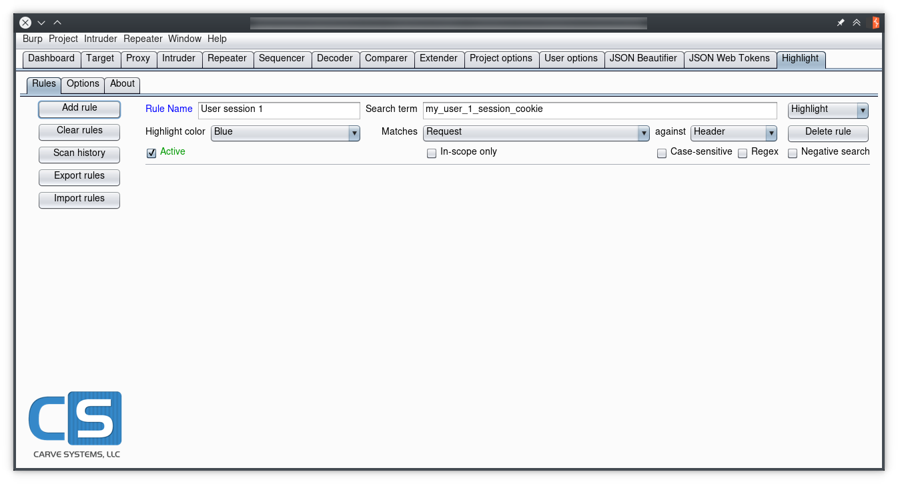

# burp-highlighter

The Highlighter plugin is a rule-based engine that can assign a color (Highlight) and/or a Comment to requests and responses in the Proxy tab, according to user-defined values.

It looks like this:

Each rule specifies the color of the requests matching the parameters: search term, type and target. The engine will try to match each incoming request/response against every active rule in real time. Alternatively, the user can click "Scan history" to highlight or comment rules that are already present in the proxy history. As exposed by the Extender API, the following fields can be used to match against:

* Request
	* Method
	* URL
	* Header
	* Body
	* Any
* Response
	* Cookies
	* Header
	* Body
	* Mime
	* Status code
	* Any
* Both
	* Header
	* Body
	* Any

If the match **result** is `true`, the selected action will be performed on the proxy entry, highlighting it with the specified color, adding a comment using the defined `Rule Name` or both. 

## How to install

You can either build it from source or download the pre-built jar file (see [Releases]).

To install it, click "Add" on the Burp Extender tab, select "Java" as the extension type, then click "Select file..." and browse to the jar file location.

